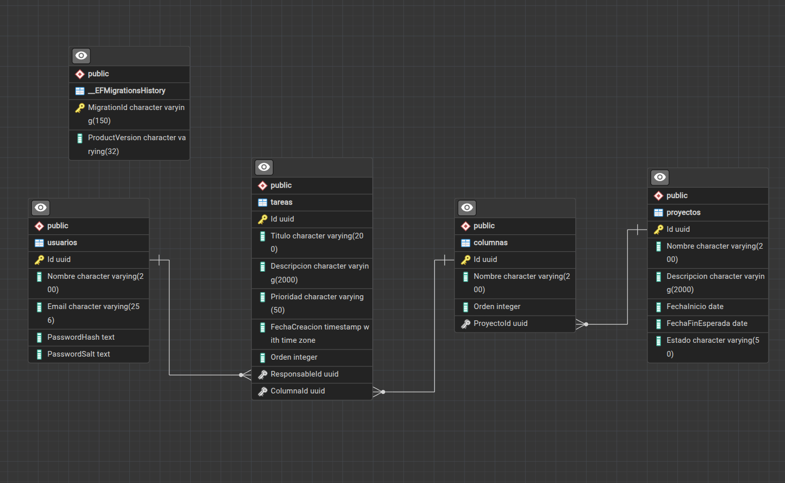

# Project Management — Tablero Kanban

Sistema de gestión de proyectos con tablero Kanban, tiempo real vía SignalR, y reportes PDF/Excel. Backend en .NET 8 (hexagonal), frontend en Angular 17 + PrimeNG (Sakai).

## Stack Tecnológico

| Capa | Tecnología | Versión |
|---|---|---|
| Backend | .NET / C# | 8.0 |
| ORM | Entity Framework Core | 8.0.* |
| DB driver | Npgsql.EntityFrameworkCore.PostgreSQL | 8.0.* |
| Base de datos | PostgreSQL | 18-alpine |
| Auth | JWT (Microsoft.AspNetCore.Authentication.JwtBearer) | 8.0.* |
| Mapeo objeto-objeto | Mapster + Mapster.DependencyInjection | 10.0.11 |
| PDF | QuestPDF | 2026.7.2 |
| Excel | ClosedXML | 0.105.1 |
| Tiempo real | SignalR | incluido en ASP.NET Core 8 |
| Tests backend | xUnit + Moq | xunit 2.5.3, Moq 4.20.70 |
| Frontend | Angular | 17.0.5 |
| UI | PrimeNG + template Sakai | 17.2.0 |
| Drag & drop | Angular CDK | 17.0.2 |
| Cliente tiempo real | @microsoft/signalr | 8.0.7 |
| Tests frontend | Karma + Jasmine (Firefox headless) | — |


## Arquitectura

### Backend — Hexagonal (Domain / Application / Infrastructure / Api)

- **Domain**: entidades puras (`Usuario`, `Proyecto`, `Columna`, `Tarea`) y enums (`EstadoProyecto`, `Prioridad`). Cero dependencias — ni de EF Core, ni de nada externo.
- **Application**: casos de uso (`ProyectoService`, `ColumnaService`, `TareaService`, `AuthService`, `ReporteService`, `UsuarioService`) y *ports* (interfaces): `IRepository<T,TKey>` genérico + repos específicos (`IProyectoRepository`, etc.), `IUnitOfWork`, `IPasswordHasher`, `ITokenService`, `ITableroNotifier`, `IReporteExporter`. Solo depende de Domain.
- **Infrastructure**: adaptadores que implementan esos ports — `ProjectManagementDbContext` + `IEntityTypeConfiguration` por entidad, repos concretos, `PasswordHasher` (PBKDF2), `JwtTokenService`, `TableroNotifier` (SignalR), `QuestPdfReporteExporter`, `ClosedXmlReporteExporter`. Depende de Application + Domain.
- **Api**: controllers, `Program.cs` (DI, middleware, CORS, auth), `TableroHub`. Depende de las tres capas anteriores.

**Por qué hexagonal**: el dominio (reglas de negocio — no borrar columna con tareas, recalcular orden al mover tarea, etc.) queda aislado de EF Core, de SignalR y de HTTP. Cambiar de Postgres a otro motor, o de SignalR a otra cosa, no toca una sola línea de Domain ni de los casos de uso — solo el adaptador correspondiente en Infrastructure. También hace los casos de uso testeables con mocks de los ports (ver `backend/Tests`), sin DB real de por medio.

**`IRepository<T,TKey>` genérico**: pedido explícito del spec ("Create Generic Class for basic cruds"). Cubre Get/GetById/Add/Update/Delete comunes; cada entidad que necesita algo más (paginación, filtros, `GetByProyectoIdAsync`, etc.) extiende con su propia interfaz (`IProyectoRepository : IRepository<Proyecto, Guid>`, etc.) en vez de forzar todo en la interfaz genérica.

**Mapster en vez de mapeo manual**: `IMapper` inyectado por constructor (estilo DI, no el helper estático `.Adapt<T>()`) en cada service. Cada entidad tiene su `*MappingConfig : IRegister` (p. ej. `ProyectoMappingConfig`) con las conversiones enum↔string y los `.Ignore()` de navegación/Id. `TypeAdapterConfig.GlobalSettings.Scan(...)` en `Program.cs` descubre todos los `IRegister` del assembly Application automáticamente — una entidad nueva no requiere tocar `Program.cs`.

### Frontend — Feature-based / por capas

- `core/`: transversal a toda la app — `auth/` (servicio, guard, interceptor), `usuarios/` (no son datos de un proyecto en particular).
- `features/proyectos/`: todo lo que cuelga de un proyecto, anidado — `columnas/`, `tareas/`, `tablero/` (Kanban), `reportes/`. Reflejan el anidamiento real de las rutas de la API (`api/proyectos/{id}/columnas`, etc.).
- `layout/`: shell de la app heredado del template Sakai (topbar, sidebar, menú, tema).
- Sin URLs de servicio hardcodeadas en componentes o servicios — todo sale de `environment.ts` / `environment.prod.ts` (`apiUrl`, `hubUrl`).
- Módulos lazy-loaded (`ProyectosModule`) — el árbol de rutas de proyectos/columnas/tareas/tablero no se descarga hasta que se navega ahí.

El clon original de `sakai-ng` traía ~440 archivos de demo (uikit, charts, calendar, etc.) sin relación con el spec — se eliminaron (quedaron 203 archivos trackeados), dejando solo el shell de layout y las páginas reales (auth, notfound, access, error).

## Instrucciones de Ejecución

### Requisitos

- Docker y Docker Compose (Instrucciones de instalación se pueden encontrar en [Documentación de Docker](https://docs.docker.com/engine/install) )

### Variables de entorno

Este repo usa **`.env.example` directamente como fuente real de variables** (no hay `.env`, ignoradas adecuada en `gitignore`), realizadas de esta forma únicamente para este ejercicio
- Cambiar `SECURITY__PEPPER` y `JWT__KEY` (vienen con placeholders `CHANGE_ME_...`).
- **Ojo**: cambiar `SECURITY__PEPPER` invalida el hash de los usuarios sembrados (ver abajo) — habría que regenerarlo.

### Opción 1 — Stack "producción" (Angular compilado servido por nginx)

```
docker compose up --build
```

Levanta `postgres` + `api` (imagen `final`, ASP.NET Core runtime) + `frontend` (build de Angular con `ng build --configuration production`, servido por nginx, que además hace reverse proxy de `/api/` y `/hubs/` — incluyendo el upgrade de WebSocket — hacia el contenedor `api`).

- Frontend: http://localhost:8081
- API: http://localhost:5115
- Postgres: localhost:5432 (validado tablas creadas por PgAdmin)

### Opción 2 — Stack de desarrollo (hot reload)

```
docker compose -f docker-compose.dev.yml up --build
```

`api` corre con `dotnet watch run` (bind mount de `./backend`), `frontend` con `ng serve --host 0.0.0.0` (bind mount de `./frontend`, `node_modules` como volumen anónimo para no pisar el instalado en la imagen). Cambios en el código del host se reflejan sin rebuildear.

- Frontend: http://localhost:4200
- API: http://localhost:5115

> Las dos stacks anteriores comparten el mismo volumen `postgres_data` (mismo nombre de proyecto Compose, mismos `container_name`) — es el mismo dataset sembrado en ambos casos, pero **no pueden correr al mismo tiempo** (colisión de nombre de contenedor).

### Opción 3 — Tests (contenedores dedicados, no se auto-arrancan con `up`)

```
docker compose -f docker-compose.test.yaml run --rm backend-test
docker compose -f docker-compose.test.yaml run --rm frontend-test
```

`backend-test` corre `dotnet test` sobre `ProjectManagement.Application.Tests.csproj`. `frontend-test` instala Firefox headless en la imagen y corre `ng test --watch=false --browsers=FirefoxHeadless`.

### Usuarios sembrados

La migración inicial (`InitialCreate`) siembra 2 usuarios — no hace falta registrarse:

| Email | Password |
|---|---|
| `admin1@projectmanagement.local` | `Admin123!` |
| `admin2@projectmanagement.local` | `Admin123!` |

### Migraciones

Migración inicial escrita a mano (no con `dotnet ef migrations add`, por decisión del proyecto de no ejecutar comandos que instalen/generen desde este entorno) en `backend/Infrastructure/Persistence/Migrations`. Se aplica sola al levantar el contenedor `api` (EF Core corre `Database.Migrate()` al iniciar) — no hace falta correr `dotnet ef database update` manualmente al usar Docker.

## Tiempo Real — SignalR

**Elegido**: SignalR, sobre `TableroHub` (`/hubs/tablero`), con grupos por tablero (`tablero-{proyectoId}`) — un cliente solo recibe eventos del tablero al que se unió explícitamente vía `UnirseTablero(proyectoId)`, sin fuga entre tableros. Autenticación JWT: el token normal va como header en HTTP, pero en el upgrade a WebSocket el browser no puede setear headers custom, así que el cliente SignalR manda el token como query string (`?access_token=`) y el backend lo intercepta en el evento `OnMessageReceived` de JwtBearer, solo para requests a la ruta del hub — patrón estándar documentado de SignalR + JWT, no un workaround inventado.

Eventos: create/update/delete de `Tarea` mandan el `TareaDto` completo; mover (reorder dentro de columna o entre columnas) manda un `TareaMovidaNotification` con las listas reindexadas completas de la columna origen y destino, para que cada cliente conectado aplique el estado autoritativo sin tener que re-consultar — así el "menos de dos segundos" del spec es trivial, se empuja en el mismo request que ya recalculó el orden.

**Alternativas descartadas**:

- **WebSockets crudos**: hay que reconstruir a mano reconexión, agrupación por tablero y el bridge con JWT que SignalR da de fábrica. Más trabajo, cero beneficio para este alcance.
- **Socket.IO**: es una librería centrada en Node — meterla en un backend .NET implica un puente extra o un servidor Node paralelo solo para esto. No tiene sentido para un stack ya 100% .NET/Angular.
- **Server-Sent Events (SSE)**: unidireccional (servidor→cliente), y no trae agrupación/salas nativa — habría que inventar el concepto de "grupo por tablero" a mano igual que con WebSockets crudos.
- **Servicio de terceros (Pusher, Ably, etc.)**: dependencia externa (y de pago) para algo que el propio stack .NET ya resuelve sin infraestructura adicional — rompe además el "todo corre con `docker compose up`" del spec.

## Estrategia de Ordenamiento

`Columna` y `Tarea` tienen un campo `Orden` (`int`), contiguo y base 0 dentro de su contenedor (proyecto para columnas, columna para tareas).

- **Alta**: se agrega al final (`Orden` = máximo actual + 1, o 0 si no hay ninguna) — el cliente nunca decide el `Orden` de un nuevo elemento.
- **Reordenar**: el cliente (Angular CDK, tras `moveItemInArray`/`transferArrayItem`) manda la lista completa de ids en su orden final para la(s) columna(s) afectada(s). El backend reindexa esa lista 0..n-1 (`ColumnaService.ReorderAsync` para columnas, `TareaService.MoverAsync` para tareas — este último además reindexa la columna origen si la tarea cambió de columna, para cerrar el hueco que deja). Si algún id de la lista no pertenece al contenedor esperado, se rechaza con `ArgumentException` (→ 400).
- Un solo endpoint (`PUT .../tareas/{id}/mover`) cubre tanto el reorder dentro de una columna como el move entre columnas — CDK genera la misma forma de evento para ambos casos, no hace falta distinguir en el backend.

**Alternativa descartada — índice fraccionario / *rank* lexicográfico** (tipo LexoRank/fractional indexing, donde insertar entre dos elementos solo requiere calcular un valor intermedio sin tocar al resto): evita reescribir todos los `Orden` en cada movimiento, pero suma complejidad real (rebalanceo cuando dos ranks colisionan por precisión, generación de strings/floats intermedios) que no se justifica al tamaño de una columna de un tablero Kanban (decenas de tareas, no miles). El reindex O(n) es simple, siempre correcto, y CDK ya te da la lista completa de todas formas — no hay ganancia real en evitarlo acá. `TareaService.MoverAsync` es justamente el archivo que el spec pide cubrir con test unitario (ver sección Tests).

## Patrón de Exportación — PDF / Excel

Strategy pattern vía el port `IReporteExporter` (`Formato`, `ContentType`, `ExtensionArchivo`, `byte[] Exportar(ProyectoReporteDto)`). `ReporteService`:

1. Arma **un solo** `ProyectoReporteDto` con **una sola** consulta por reporte (`IProyectoRepository.GetByIdAsync` + `ITareaRepository.GetByProyectoIdAsync`, ya con `.Include(Columna, Responsable)`) — el mismo DTO alimenta cualquier formato, pedido explícito del spec.
2. Resuelve el exportador correcto desde un `IEnumerable<IReporteExporter>` inyectado, indexado por `Formato` en el constructor.

`QuestPdfReporteExporter` (`Formato = "pdf"`) y `ClosedXmlReporteExporter` (`Formato = "xlsx"`) son las dos implementaciones actuales — encabezado con datos del proyecto + fecha de generación, tabla de tareas (columna, responsable, prioridad). **Agregar un tercer formato** (CSV, por ejemplo) significa escribir una clase nueva que implemente `IReporteExporter` + una línea de registro en DI (`AddScoped<IReporteExporter, NuevoExporter>()`) — `ReporteService` no cambia una sola línea.

Frontend: `reporte.service.ts` pide el archivo con `responseType: 'blob'`, lee el nombre real desde el header `Content-Disposition` (expuesto explícitamente vía CORS `WithExposedHeaders`) y dispara la descarga sintetizando un `<a download>`.

## Tests

### Backend (`backend/Tests/ProjectManagement.Application.Tests`) — xUnit + Moq, 19 tests

| Archivo | Qué cubre |
|---|---|
| `Tareas/TareaServiceTests.cs` | Reorder dentro de columna, reorder cruzando columnas (origen y destino), `OrdenIds` inválido → `ArgumentException`, tarea inexistente no notifica, regresión de la tarea-cero-en-columna-vacía |
| `Columnas/ColumnaServiceTests.cs` | Auto-asignación de `Orden` al crear, bloqueo de delete con tareas, reorder rechaza id ajeno al proyecto |
| `Auth/AuthServiceTests.cs` | Email inexistente, password incorrecta, login válido devuelve token |
| `Security/PasswordHasherTests.cs` | Roundtrip de verify, password incorrecta rechazada, dos hashes del mismo password con salt distinto |
| `Mapping/MappingConfigTests.cs` | `ParseEstado`/`ParsePrioridad` válidos e inválidos (Theory) |

`TareaServiceTests` es la cobertura que el spec pide explícitamente para el cálculo de posición al reordenar.

### Frontend — Karma/Jasmine (Firefox headless), 13 specs

| Archivo | Qué cubre |
|---|---|
| `core/auth/auth.service.spec.ts` | 3 |
| `core/auth/auth.guard.spec.ts` | 2 |
| `core/auth/auth.interceptor.spec.ts` | 4 |
| `features/proyectos/tareas/tarea.service.spec.ts` | 2 |
| `features/proyectos/tablero/tablero.component.spec.ts` | 2 — contraparte frontend del reorder: arma el componente con spies (sin `TestBed`, sin tocar SignalR real), dispara `drop()` con un evento `CdkDragDrop` armado a mano, verifica que `mover()` reciba la lista completa correcta y que un error revierta ambas columnas y el `columnaId` de la tarea movida |

## Declaración de Uso de IA

Todo el código de este repositorio fue generado con **Claude Code** (Anthropic), bajo supervisión humana constante, fase por fase (ver historial de commits — commits atómicos por fase/feature). Rol de cada parte:

- **Claude Code**: escribió entidades, ports, servicios, controllers, migraciones, componentes Angular, Dockerfiles, configuración de Compose, y este mismo README.
- **Humano**: ejecutó cada comando real (`dotnet build`, `dotnet ef database update`, `docker compose up`, `npm install`, `dotnet test`, `ng test`) — Claude Code nunca corrió builds, migraciones ni contenedores directamente, solo propuso el comando exacto y esperó; probó manualmente cada feature en el browser antes de dar por cerrada una fase (login, CRUD de proyectos/columnas/tareas, drag & drop, tiempo real con dos pestañas, descarga de PDF/Excel); corrigió versiones de paquete cuando la primera propuesta de Claude Code resultó inexistente o incorrecta (p. ej. Mapster 7.4.0 → 10.0.11, `Microsoft.Extensions.Configuration.Memory` que no existe en NuGet); tomó decisiones de producto explícitas (usar `.env.example` como fuente real de env vars, separar los `docker-compose*.yml` por responsabilidad, elegir Firefox sobre Chrome para los tests por no tener Chrome instalado).
- Bugs reales encontrados y corregidos durante el desarrollo (no hipotéticos): CORS bloqueando el negotiate de SignalR por `withCredentials`, un `Program.cs` sin `app.Run()` que hacía salir el contenedor sin loguear nada, un `NullReferenceException` al crear la primera tarea de una columna vacía por falta de fixup de EF, `fileReplacements` faltante en `angular.json` que hacía que el build de producción nunca reemplazara `environment.ts`, el date-picker/dropdown de proyecto recortados dentro del `p-dialog` (fix: `appendTo="body"`), ausencia de botón de logout en el topbar (se quitaron además `Calendar`/`Profile`/`Settings`, botones demo heredados de Sakai sin funcionalidad real — `Settings` apuntaba a `/documentation`, ruta que ya no existe desde la depuración del template), y el `p-password` del login mostrando el medidor de fortaleza de contraseña (`feedback`, activado por default en PrimeNG) — tiene sentido en un formulario de registro, no en un login; se desactivó con `[feedback]="false"`. También: `Program.cs` nunca llamaba `Database.Migrate()` — el esquema y los usuarios sembrados solo existían porque se corrió `dotnet ef database update` a mano una vez, al principio, contra el Postgres de Docker; un clon nuevo con un volumen vacío habría fallado en la primera query real. Encontrado al revisar por qué el README ya documentaba el auto-migrate como si existiera; se agregó el `Database.Migrate()` real en el arranque (idempotente, corre en cada inicio del contenedor `api`). Otro: editar una tarea existente mostraba "No se pudo guardar la tarea." aunque el guardado sí funcionaba (UPDATE correcto en Postgres, confirmado por el humano vía logs) — `TareaService.UpdateAsync` derivaba el `ProyectoId` del DTO (usado por el chequeo de pertenencia del controller) leyendo la navegación `Columna` *después* de mutar y guardar la entidad, en vez de capturarlo antes como ya hacían `MoverAsync`/`DeleteAsync` en el mismo archivo; el chequeo post-guardado daba un falso mismatch y el controller devolvía 404 pese al guardado exitoso. Fix: `UpdateAsync` ahora recibe `proyectoId` y valida pertenencia inmediatamente después de obtener la tarea, antes de mutarla — mismo patrón que sus vecinos.

## Diagrama de Base de Datos




## Posibles mejoras

- **URGENTE**: Obviamente esto es una POC para probar las habilidades de desarrollo, pero en terminos practicos seria mejor utilizar [Jira](https://www.atlassian.com/software/jira), [Azure DevOps](https://azure.microsoft.com/en-us/products/devops) o alguna herramienta de terceros para este tipo de manejos de projectos SCRUM
- **URGENTE**: Actualizar a las versiones más nuevas y estables del backend (.NET 10) y frontend (Angular 22) (la db si esta actualizada), al momento que se escribe este README
- **MEDIO** : En vez de manejar de manera interna la autenticación, se puede utilizar una herramienta de terceros dedicada para gestionar de mejor manera este tema de permisos [Keycloak por ejemplo](https://www.keycloak.org/)
- **BAJO**: Se puede realizar mejoras estructurales para adoptar las nuevas estructuras de .NET, como constructores a nivel de 

```c#
// Parameters are declared right in the class definition line
public class Customer(string name, string email)
{
    // The parameters 'name' and 'email' are in scope for the entire class body
    public string Name { get; set; } = name;
    public string Email { get; set; } = email;

    public void PrintDetails()
    {
        // You can also access them directly inside methods
        Console.WriteLine($"Customer {name} can be reached at {email}.");
    }
}

```